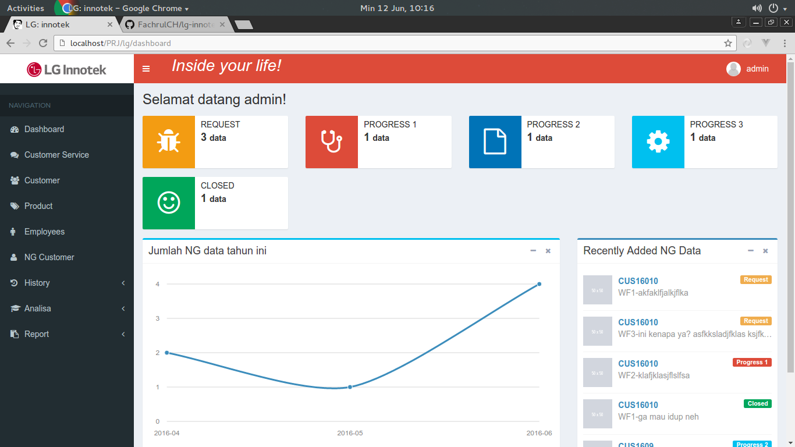

# LG Innotek

**Sebuah aplikasi pengelolaan data NG customer**


## Instalasi
Download repository ini jadi zip
Extract di folder servermu (misal: `C:\xampp\htdocs\lg-innotek`)

Install database (`db_lginnotek.sql`) di local kamu

## Konfigurasi database
Untuk koneksi ke database, buka file `\application\config\database.php` dan ubah baris username, password, database sesuai environtmen local km
Contoh sbb:

``` php
$db['default'] = array(
	'dsn'	=> '',
	'hostname' => 'localhost',
	'username' => 'root',
	'password' => 'katasandi',
	'database' => 'db_lginnotek',
	'dbdriver' => 'mysqli',
	'dbprefix' => '',
	'pconnect' => FALSE,
	'db_debug' => TRUE,
	'cache_on' => FALSE,
	'cachedir' => '',
	'char_set' => 'utf8',
	'dbcollat' => 'utf8_general_ci',
	'swap_pre' => '',
	'encrypt' => FALSE,
	'compress' => FALSE,
	'stricton' => FALSE,
	'failover' => array(),
	'save_queries' => TRUE
);
```

## Konfigurasi aplikasi
Kalau km mengekstrak file aplikasi bukan dengan nama `lg-innotek` maka perlu ada aplikasi lebih lanjut
yaitu ubah file `\application\config\config.php` 
``` php
$config['base_url']	= 'http://'.$servername.":".$port.'/lg-innotek/';
```
Ubah kata lg-innotek sesuai dengan nama folder km di `C:\xampp\htdocs\`

[](http://lginnotek.hol.es/)

